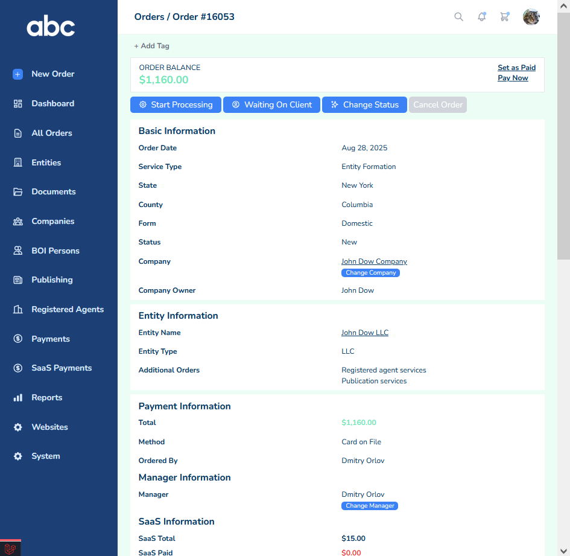

# SaaS Platform

This folder contains sample screenshots of SaaS application interfaces.  

## Orders Table

Table with searching, sorting, filtering, and other advanced features

## Order Details Page

Fully responsive interface with clean layout and structured data presentation:

## Modal Windows

Reusable modal dialogs, applied across the app to let users complete tasks without leaving the current page.

## Reports

Comprehensive reporting section for tracking key data and business metrics.

